# Python_dataviz
## Homework1
 นางสาวรสสุคณธ์ เอกไชย รหัสนักศึกษา 603021315-4 หลักสูตรสารสนเทศสถิติ ชั้นปีที่ 3 
## โดยมีขั้นตอนการใช้งาน 3 ขั้นตอนใหญ่ๆ ดังนี้
    1.การติดตั้งโปรแกรม python 
    2.การใช้งาน Google Colab ที่ใช้ในการเขียนโค้ด Python 
    3.การใช้งาน GitHub หรือ website Git (version control repository) ที่อยู่บน internet 
    4.การใช้งาน Visual Studio Code
### ขั้นตอนที่ 1 : การติดตั้งโปรแกรม python
ท่านสามารถติดตั้งโปรแกรมได้ง่ายๆ โดยค้นหาคำว่า anaconda mini download บน Google
และคลิกเลือก ดังรูปภาพข้างล่าง 

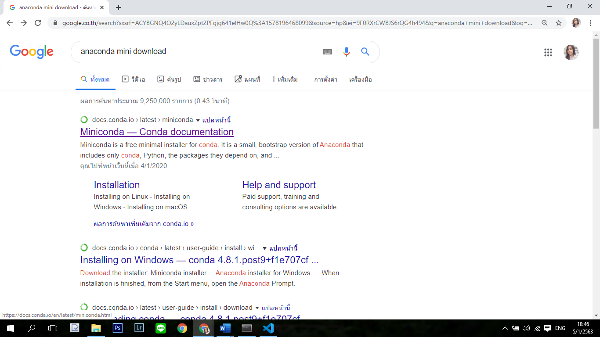

หรือสามารถเข้าไปดาวน์โหลดได้ที่ https://docs.conda.io/en/latest/miniconda.html     โดยท่านควรจะเลือกขนาดให้เท่ากับคอมพิวเตอร์ของท่านเอง ซึ่งจะมีทั้ง 32bit/64bit และเลือกดาวน์โหลดเวอร์ชั่น Python 3.7

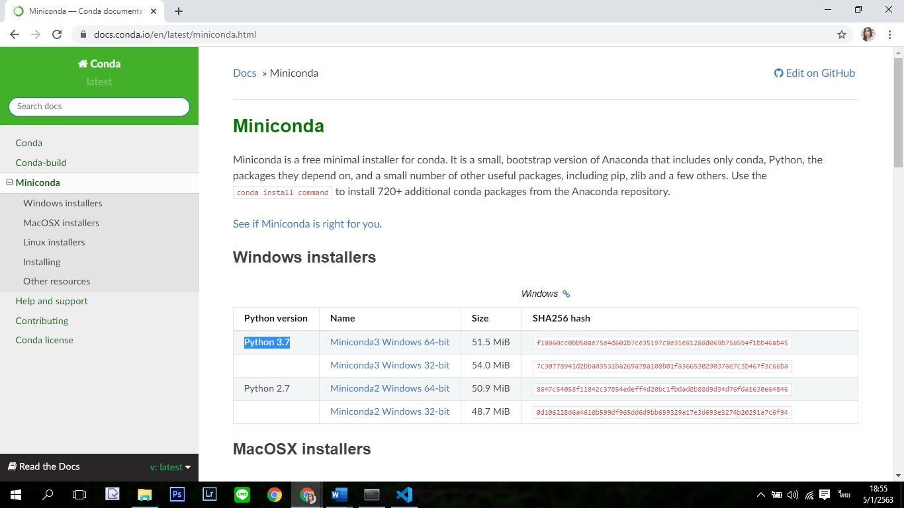

เมื่อทำการดาวน์โหลดเสร็จสิ้นแล้ว ท่านก็สามารถค้นหา โดยการคลิกไป Search Windows ที่เป็นรูปแว่นขยายมุมล่างซ้ายของคอมพิวเตอร์ของท่านจากนั้นก็ค้นหาคำว่า Anaconda Prompt 

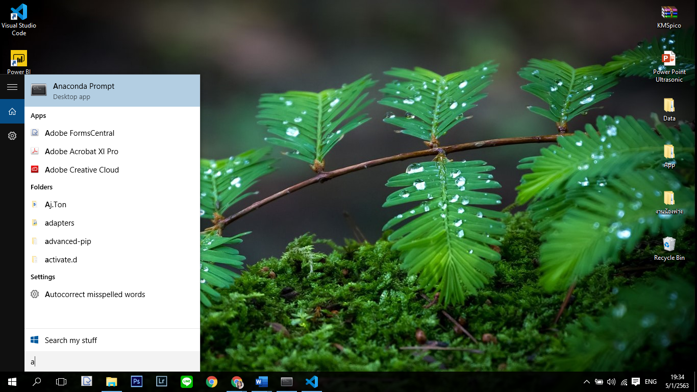

เพียงเท่านี้ ท่านก็สามารถติดตั้งโปรแกรม python เสร็จเรียบร้อยแล้ว เมื่อคลิกเข้าไปในโปรแกรม Anaconda Prompt ก็จะเป็นหน้าต่าง ดังรูปภาพนี้

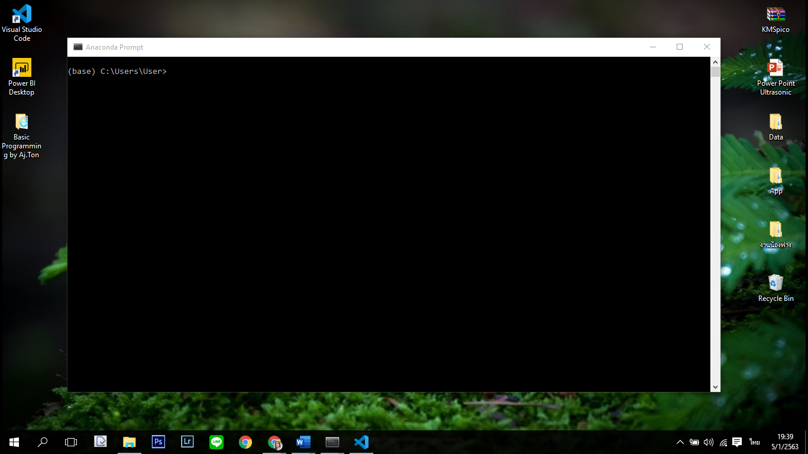

    หลังจากนั้นทำการสร้าง Folder เพื่อให้สามารถเก็บข้อมูลที่เราเขียนขึ้นใน Anaconda Prompt ได้โดยใช้คำสั่ง cd "ข้างในเครื่องหมายนี้คือ Folder ที่เราสร้างขึ้น " ดังรูปภาพข้างล่าง
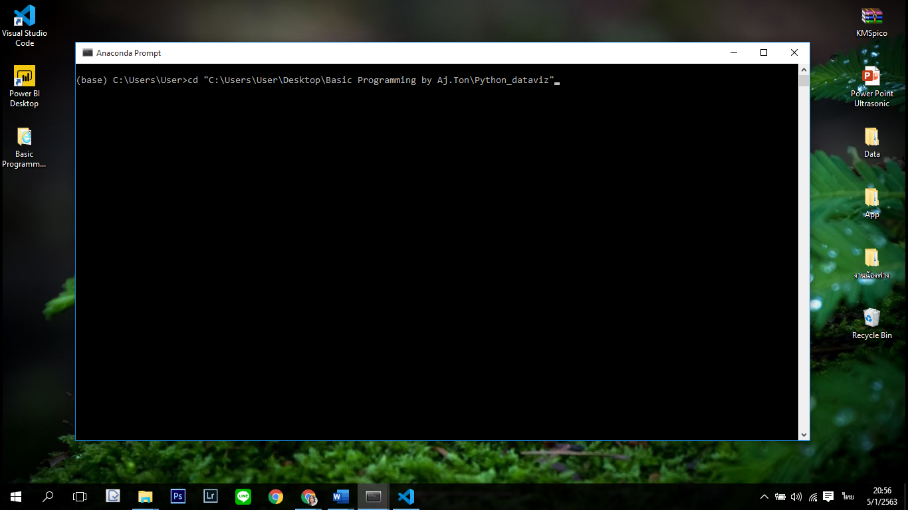  
   

### ขั้นตอนที่ 2 : การใช้งาน Google Colab ที่ใช้ในการเขียนโค้ด Python 
#### "Google Colab" คืออะไร?

[Google Colab](https://colab.research.google.com) เป็นโปรเจ็คที่พัฒนาโดยทีม Google Research ที่เปิดให้นักศึกษาและคนทั่วไปที่อยากเริ่มเขียนโค้ด Python ใช้งานได้ฟรีผ่าน Google Chrome Browser นักเรียนที่ยังไม่มี Chrome ต้อง install ก่อนนะคะ 
และท่านจะพบหน้าต่าง ดังรูปภาพนี้

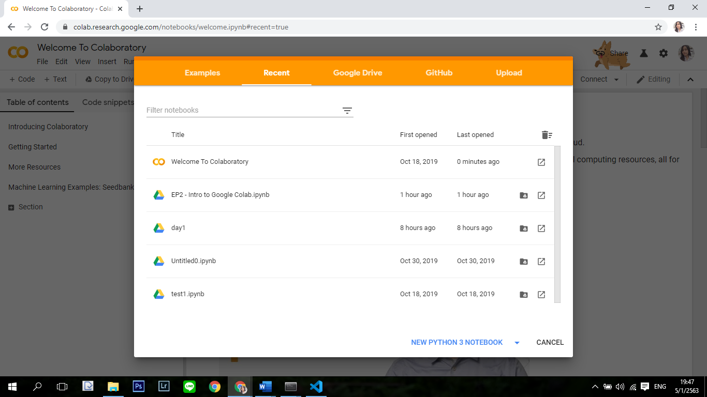

และเมื่อท่านต้องการจะเขียนโค้ด Python ให้ท่าน กดเลือกไปที่ตัวหนังสือสีน้ำเงิน (NEW PYTHON 3 NOTEBOOK) ท่านก็สามารถลงมือเขียนโค้ดได้ทันที

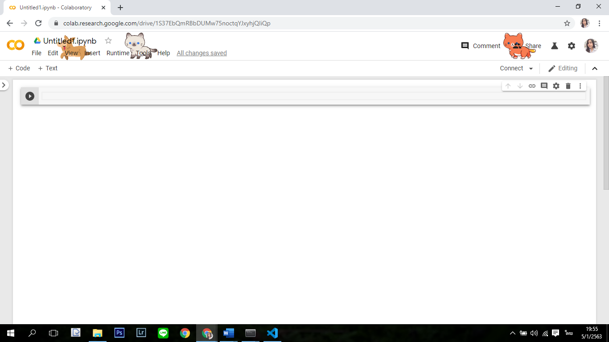

   และถ้าหากท่านอยากให้มีรูปตัวการ์ตูนให้ปรากฎ ดังเช่นรูปภาพข้างบน เพื่อเพิ่มสีสันในการทำงาน ท่านก็สามารถตกแต่งเจ้าตัว Google Colab ของท่านได้ ดังนี้

    1.กดไปที่รูปการตั้งค่ามุมบนขวามือ (open settings)
    2.มันจะขึ้นหน้าต่างดังรูปภาพข้างล่าง ให้ท่านกดเลือกที่ Miscellaneous ซึ่งจะมี 2 โหมดให้ท่านเลือก ท่านก็สามารถเลือกได้ตสมใจชอบได้เลยคะ

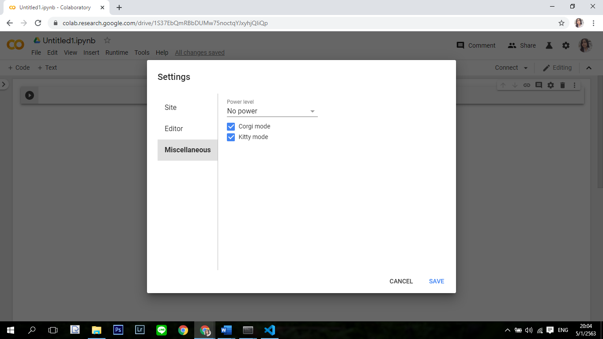

 และท่านสามารถดาวน์โหลดไฟล์ข้อมูลของท่านได้ โดยคลิกที่ File > download.ipynb เพียงเท่านี้ท่านก็จะสามารถดาวน์โหลดไฟล์ข้อมูลของท่านได้
 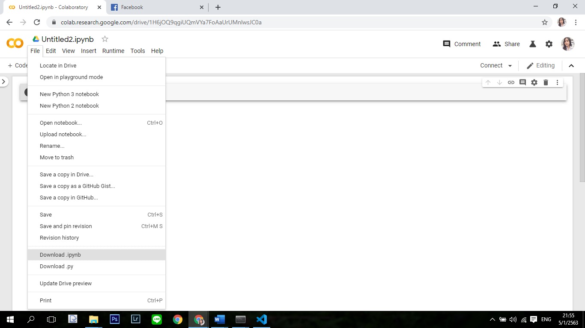

### ขั้นตอนที่ 3 : การใช้งาน GitHub หรือ website Git (version control repository) ที่อยู่บน internet 

#### "GitHub" คืออะไร?

GitHub คือ website Git (version control repository) ที่อยู่บน internet มีการทำงานแบบเดียวกับ Git เลย แต่สามารถเข้าถึงข้อมูลและจัดการไปผ่าน web โดยไม่ต้องเสียเงิน หรือลงทุกตั้ง server เพื่อติดตั้ง Git เองเลย แต่ code project ทั้งหมดจะุถูกแจกจ่ายให้คนอื่นๆสามารถเห็นได้ด้วย ซึ่ง GitHub ก็มีการเสนอ plan แบบส่วนตัวให้ถ้าอยากให้ code ไม่ถูกแจกจ่ายออกไปโดยจะมีค่าใช้จ่ายตรงนี้ ปัจจุบันมีมากกว่า 20 ล้าน user รวมกันกว่า 60 ล้าน repository บนระบบแล้ว [ท่านสามารถศึกษาเพิ่มเติมได้ที่นี่](https://saixiii.com/what-is-github/) 

ท่านสามารถเข้าไปใช้งาน GitHub ได้ที่ GitHub.com 
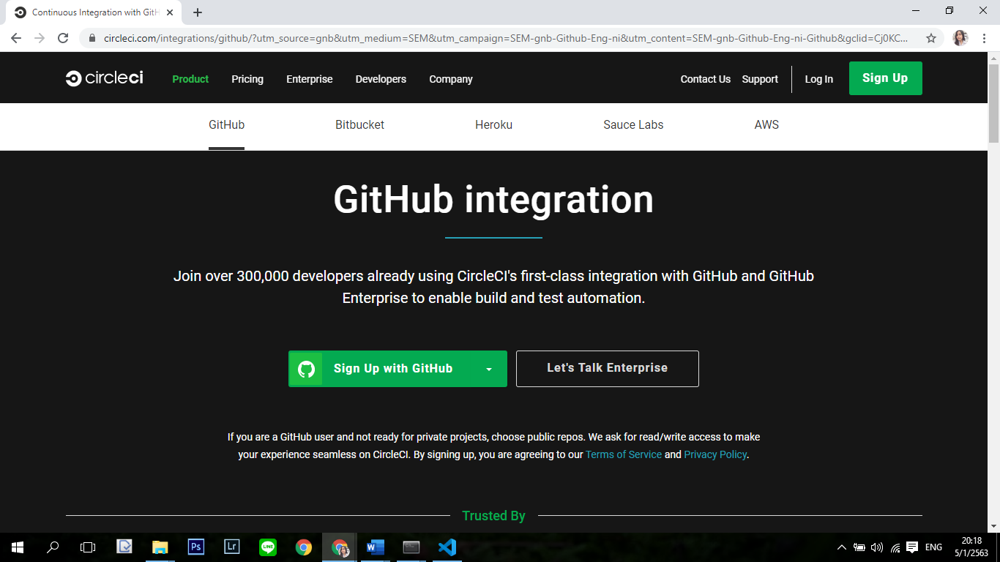

โดยคลิกที่ Sing Up เพื่อทำการสมัครสมาชิกแบบ publicหรือฟรีไม่มีค่าใช้จ่ายนั้นเอง ซึ่งการสมัคร ท่านสามารถตั้ง Username และ Password ตามใจชอบพร้อมทั้งใส่ Email ในการสมัคร เพื่อให้สามารถทำการยืนยันตัวตนได้ ดังรูปภาพด้านล่าง

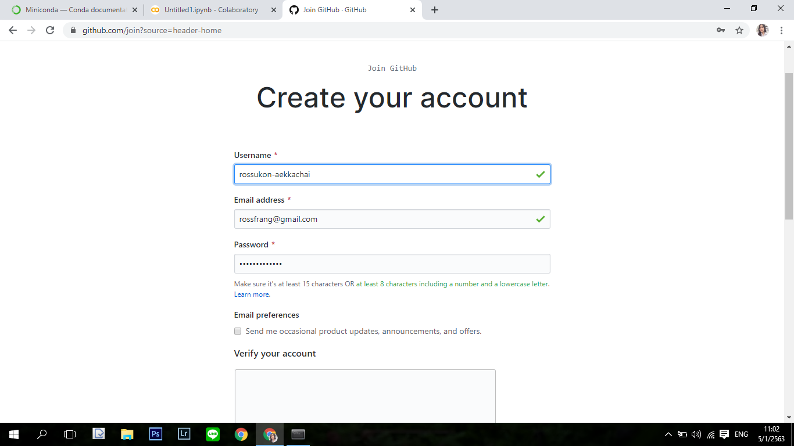

และเมื่อท่านทำการสมัครเรียบร้อยแล้ว จะปรากฏหน้าต่างดังรูปภาพข้าล่างนี้ ซึ่งจะมีช่องในการตั้งชื่องานของท่าน และท่านสามารถเลือกว่า ท่านจะอนุญาตให้เป็นสาธารณะ คือ ทุกคนสามารถเข้าดูได้ โดยกดเลือก Pubilc หรือ ท่านต้องการให้เป็นส่วนตัว ก็ให้กดเลือก Private ดังรูปข้างล่างนี้

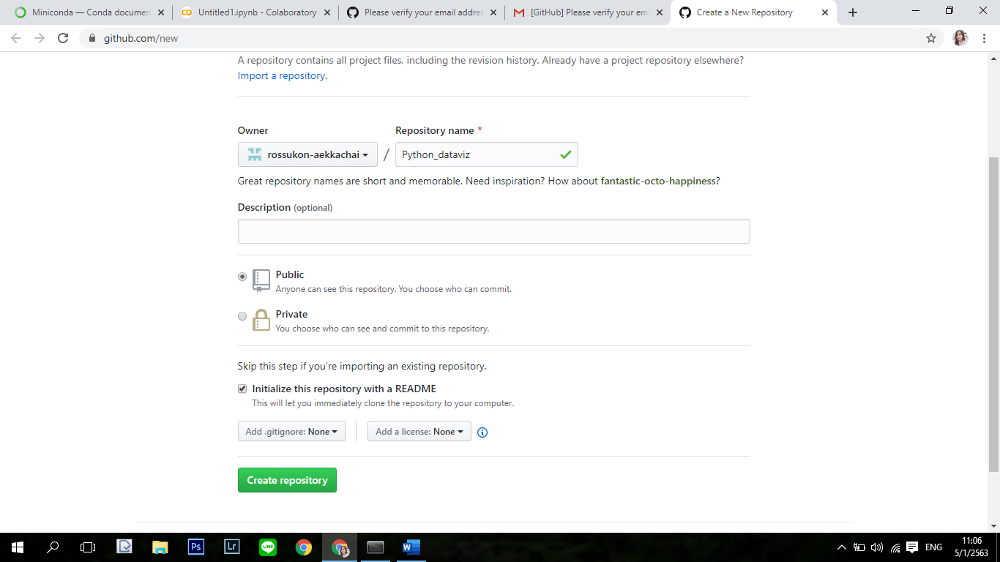

     การเข้าใช้งาน GitHub ใน Anaconda Prompt จะต้องทำการ install ก่อน โดยใช้คำสั่ง conda install -c anaconda git ดังรูปภาพข้างล่างนี้
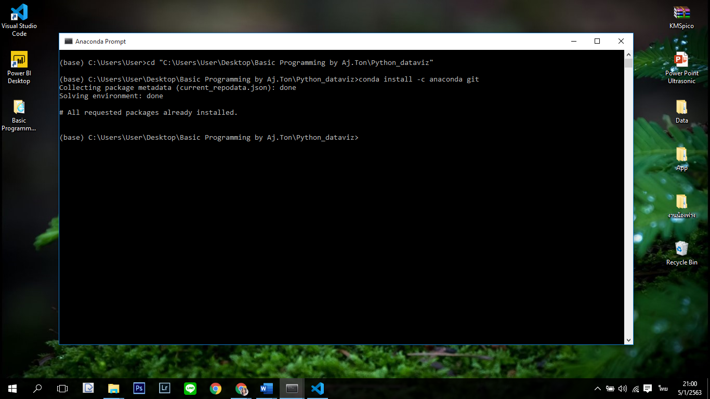

### ขั้นตอนที่ 4 :  การใช้งาน Visual Studio Code
Visual Studio Code หรือ VSCode เป็นโปรแกรม Code Editor ที่ใช้ในการแก้ไขและปรับแต่งโค้ด จากค่ายไมโครซอฟท์ มีการพัฒนาออกมาในรูปแบบของ OpenSource จึงสามารถนำมาใช้งานได้แบบฟรี ๆ ที่ต้องการความเป็นมืออาชีพ

     ซึ่ง Visual Studio Code นั้น เหมาะสำหรับนักพัฒนาโปรแกรมที่ต้องการใช้งานข้ามแพลตฟอร์ม รองรับการใช้งานทั้งบน Windows, macOS และ Linux สนับสนุนทั้งภาษา JavaScript, TypeScript และ Node.js สามารถเชื่อมต่อกับ Git ได้ นำมาใช้งานได้ง่ายไม่ซับซ้อน มีเครื่องมือส่วนขยายต่าง ๆ ให้เลือกใช้อย่างมากมาก ไม่ว่าจะเป็น 1.การเปิดใช้งานภาษาอื่น ๆ ทั้ง ภาษา C++, C#, Java, Python, PHP หรือ Go 2.Themes 3.Debugger 4.Commands เป็นต้น
สามารถดาวน์โหลดได้ที่นี่ https://code.visualstudio.com/
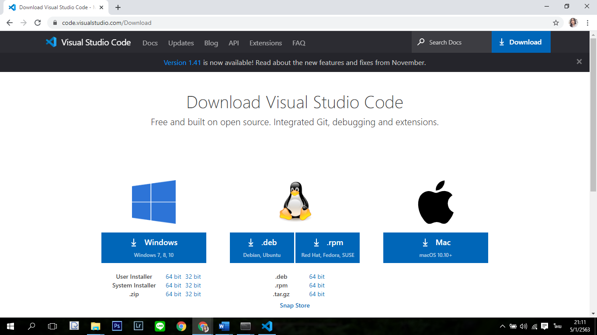
    เมื่อทำการดาวน์โหลดเสร็จสิ้นแล้ว ท่านสามารถเปิดโปรแกรมใน Anaconda Prompt ได้ โดยใช้คำสั่ง code . 
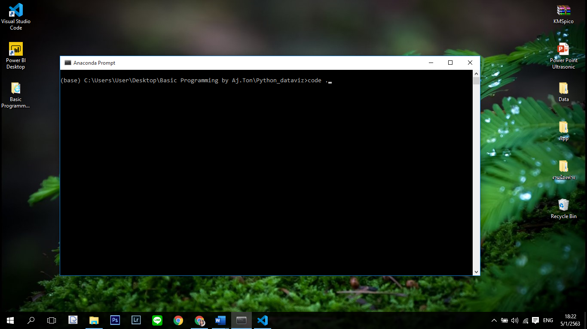    

#### ใช้งาน visual Studio Code กับ github 
    มีขั้นตอน ดังต่อไปนี้
    1.ทำการเชื่อมโปรเจค(New repository) ที่ท่านสร้างใน github โดยคลิกที่ Clone or download แล้วทำการ copy code 
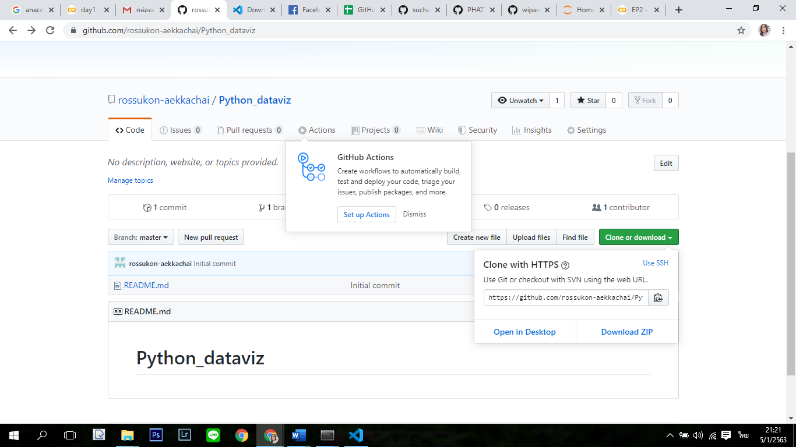  

    2.นำโค้ดที่ทำการ copy เข้ามาใน  Anaconda Prompt โดยใช้คำสั่ง cd "ข้างในเครื่องหมายนี้คือ Folder ที่ท่านสร้างขึ้น " ดังรูปภาพข้างล่าง และหลังจากนั้นใช้คำสั่ง git clone ตามด้วย ลิ้งค์ที่เราทำการ copy มา
    3.ตรวจสอบดูว่ามีไฟล์อะไรบ้างที่เชื่อมกับ github แล้ว โดยใช้คำสั่ง dir 
    4.ดูว่ามีไฟล์ไหนยังไม่เชื่อมกับ github โดยใช้คำสั่ง git status 
 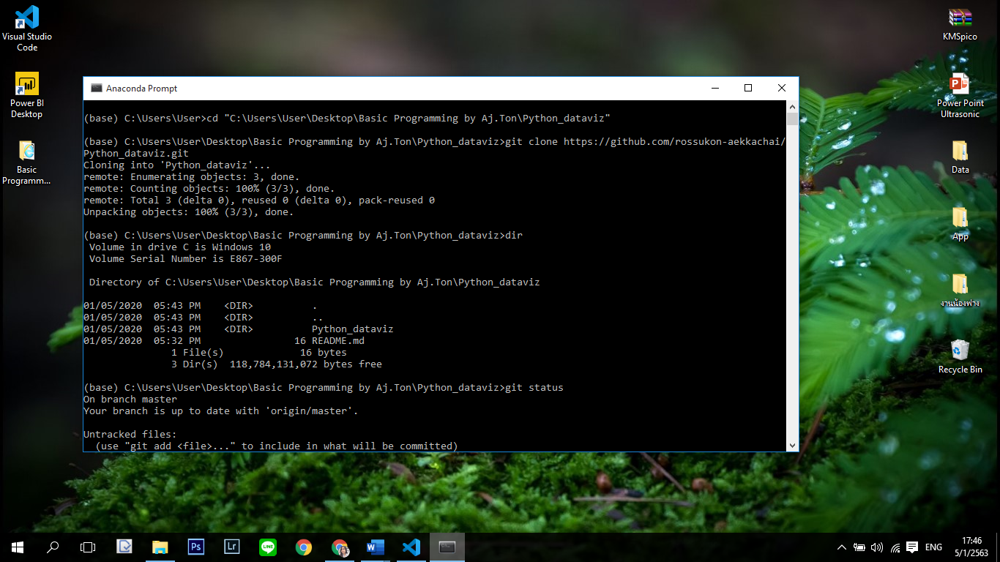   
    
    5.หากมีไฟล์ที่ยังไม่ได้ไม่เข้าไปใน git ท่านจะพบเห็นตัวไฟล์(สีแดง) และจะทำให้ไฟล์นั้นเข้าไปใน git โดยใช้คำสั่ง git add "ชื่อไฟล์นั้น" 
    6.เพื่อให้โปรแกรมทราบว่าท่านกำลังดำเนินการทำสิ่งนี้อยู่ โดยใช้คำสั่ง git commit -m "test git" ดังรูปภาพข้างล่างนี้
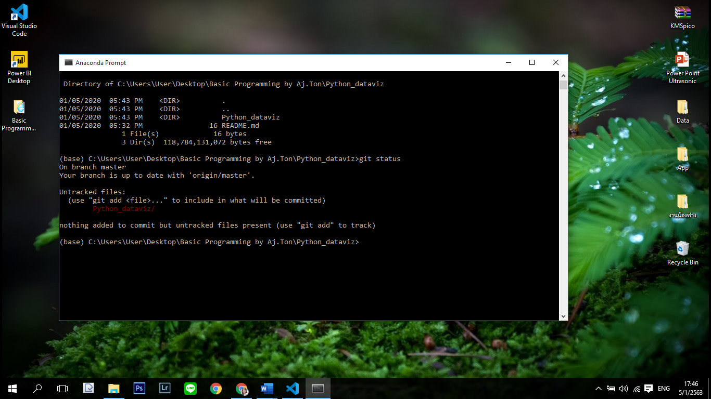   

   7.การเข้าใช้งาน จะต้องพิมพ์คำสั่ง git config --global user.email"อีเมลที่เราสมัคร" และ git config --global username ที่เราตั้งในgithub"

   8.ทำการ git commit เพื่อทำการยืนยันการเปลี่ยนแปลงจากการ add โดยใช้คำสั่ง git commit -m "test git" ซึ่งโปรแกรมจะถาม Username กับ Password ทุกครั้ง ก็ถือว่าเสร็จสิ้น
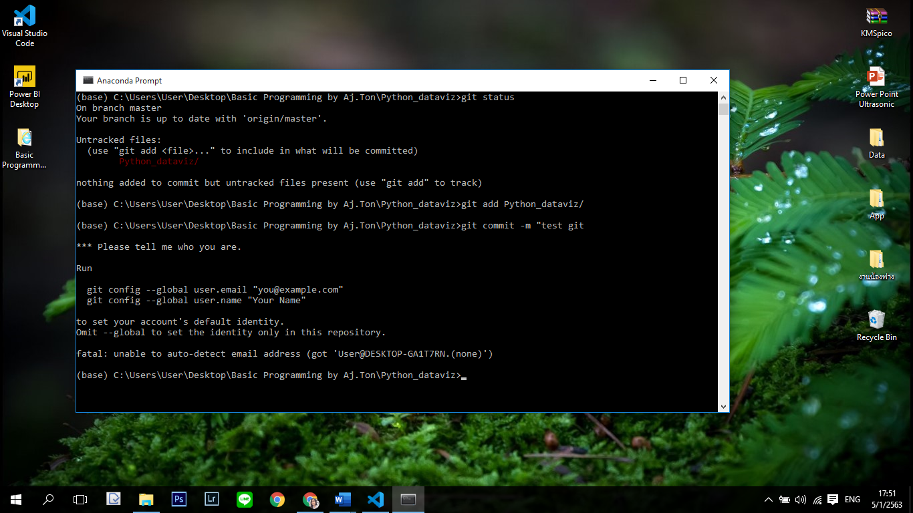 

 
    
